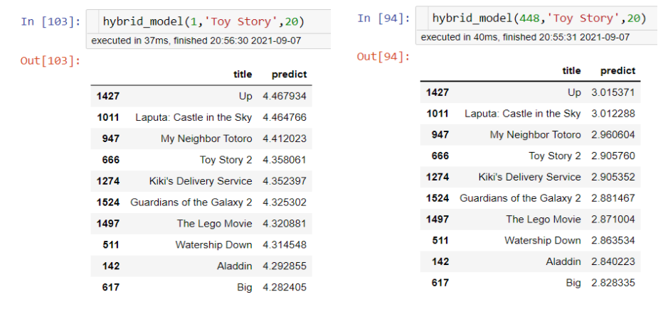

# Personalized Movie Recommendation Engine - Using Content-Based and Collaborative Filter Methods to Provide Movie Recommendations 


**Author**: Melvin Garcia

## Overview

The aim of this report is to create a movie recommender system from customer behavior data such as user-movie ratings as well as user-based movie tags, and genres. A new movie streaming platform called MovieTime is looking to implement a new feature to supplement to their current recommendation system using tags users have themselves assigned to movies they've watched. As a result, the user-generated tags would be used to supplement the current user-movie ratings (collaboartive filtering) recommendation system, to create an overall hybrid recommendation system. Through a combination of movie user-generated tags, genres, and user-movie ratings -- our hybrid recommendation model aims to become a more robust recommendation system helping define a more friendly and enticing user experience.

## Business Problem

MovieTime's current recommendation system suffers from an apparent cold-start problem in which newer users of the platform are found spending a significant amount of time searching for a new movie to watch, or not continuing to watch after their first movie. In addition to the user-ratings data MovieTime has, they aim to make use of user-generated tags and genres to create a 'content-based' recommender system to supplement the current system in place to counter the coldstart problem MovieTime is observing withing their users.

## Data

MovieTime's dataset is derived from user-to-movie ratings captured within its movie streaming platform. Moreover, with MovieTime's new 'tag' feature, each movie now contains a suite of tags marked by users. By aggregating the tags by movie, the tags (transformed into tokens) will serve as a basis of our content-based model to supplement MovieTime's current user-movie rating (collaborative filter) recommendation system. 

Currently, MovieTime's data set consists of over 25 million movie ratings -- 62,000 movies by 162,000 users and 1 million tags. For the purposes of prototyping a hybrid model using both the ratings and tags data, this analysis will focus on a smaller subset of the data consisting of 100,000 ratings -- 9,000 movies by 600 users and 3,600 tags.

## Methods

The steps below outline how we will approach creating and iterating on our collaborative filter and content-based recommendation model to later build up our hybrid model.

1. Prepare & Explore the Data
2. Collaborative Filter Model Exploration and Iteration
3. Creating Our Content Based Filter
4. Creating Our Hybrid Model

**Prepare & Explore the Data**

Initially, the data to be used for this analysis come from disparate tables. To focus our analysis, we will primarily be using the user ratings per movie. As such, the data points we need for our collaborative filter model are userId, movieId, and rating (ratings are on a scale from 1 - 5). For our content based filter model, we will need the movie title, list of genres for each movie, and tags for each movie.

Below are a few useful observations when preparing the data:
* Tags are user-generated metadata about movies. Each tag is typically a single word or short phrase. The meaning, value, and purpose of a particular tag is determined by each user.
* Ratings are made on a 5-star scale, with half-star increments (0.5 stars - 5.0 stars).
- Genres are pipe separated
- Our links dataframe contains external information to IMDB and MovieDB information, but since we are focused on building a collaborative filter for the time bring, we do not require this information at the moment.

**Collaborative Filter Model Exploration and Iteration**

In this step, we will aim to replicate and improve MovieTime's current recommendation system by exploring memory based collaboartive filtering methods while comparing different types of similarity measures -- cosine and pearson similarity. 

Additionally, due to the nature and size of the data, we will explore model based collaborative filtering and dimensionality reduction techniques to deal with the millions of user movie ratings (which ultimately result to user and movie vectors in the dimensions in the order of millions). 

This step is important for our end hybrid model because not only do we wish to recommend titles most similar to what a user is watching / have watched, but titles we think the user would rate highly based on other similar users, and what they have watched (and what our target user has not watched).

**Creating Our Content Based Filter**

In this step, we will aim to create a model using the tags and genres data to provide list a of recommendations given a movie title. Given a movie title, the content based filter model will recommend the top N most similar movies using a similarity measure constructed from analyzing the tags and genres of the given movie title to other movies.

This step is important for our end hybrid model as it will recommend similar movies to what a user is watching / have watched based on the 'content' (tags and genres in this case). Accordingly, the most similar movies based on content will be provided a predicted rating from our collaboartive filter model described in the previous step, and the end output will be the top movies ranked in order of top predicted ratings.

**Creating Our Hybrid Model**

In this last step, we will simply combine our collaborative filter and content based model. Given a user and movie title, we will output a sorted predicted rating of movies that are most similar in content to the given movie title.

Based on these results, we aim to help address the apparent cold-start problem observed with newer users on the MovieTime platform and as a result drive more engagement and more movie watching.

## Results

### Collaborative Filter Model Comparison

The visual above showcases the mean RMSE score (through 5 cross-validation folds of the user-rating data) per collaborative filter model. Based on the results, the SVD without gridsearch parameter tuning CF model performed best with a mean RMSE score of 0.878. For our hybrid model, we will move forward with the SVD without GridSearch model.

### Toy Story Content Model

Given an input of the *Toy Story* movie, we are able to observe that 6 out of 10 of the most similar movies are in fact Disney movies. The top 3 movies found most similar to *Toy Story* are also found to be a part of Pixar studios. If a user is watching or have watched *Toy Story*, they may have a penchant for animated movies or Disney movies in general. For either reason, the our content based model may not accurately capture those preferences.

In our hybrid model, we will aim to incorporate movies our user have rated in the past to tune the recommendations and deliver a clear line between a preference for Disney movies, animated movies, or something else.

### User-to-User Hybrid Model Comparison

Based on the predicted ratings between user ID 1 and user ID 488 -- it is apparent that user 1 has a higher preference for the movies found similar to *Toy Story* compared to user 448. For the top 10 movies most similar to *Toy Story*, user 1 rated the movies with an average 1.5 higher than user 448.

In the case for user 1, they may be watching *Toy Story* and given their higher ratings for similar movies, the content based model may be appropriate to serve a new movie recommendation. On the other hand, for user 448, while they did watch *Toy Story*, they rated the other similar movies lower. One could assume in addition to *Toy Story*, user 448 may have other genres they are interested in, therefore we may want to rely on collaborative filtering to identify similar users and recommend movies they like, and user 448 have not watched. Between both users, we are able to employ content and collaborative filter models to serve a recommendation.

## Conclusions and Next Steps

The model results from above are based on a smaller subset of MovieTime's entire dataset. One of the next steps would be to improve the model by incorporating a larger dataset with more users, movies, and ratings. Moreover, in the current content based model, it only incorporates text data from the user-generated tags and genres. While the user-generated tags certainly provide a unique set of tokens to generate a similarity measure between movies, it is possible to enrich how similar movies if we include data on plot descriptions, and movie metadata that includes information such as cast and crew. To address our cold-start problem, having a solid content-based recommender system may provide for a more friendly and enticing user experience.

Lastly, to test our new hybrid model, we can perform a set of A/B tests in which one cohort of users will be exposed to the current recommender system, with another cohort of users exposed to the new hybrid recommender system. We will aim to create an analytics report to prove (or disprove) higher engagement metrics using the new hybrid recommender system.

## For More Information

Please review our full analysis in [our Jupyter Notebook](./0-MovieLens_Recommendation_System.ipynb) or our [presentation](./MovieTimeRecommenderSystem_Flatiron_Presentation_MG.pdf).

For any additional questions, please contact **Melvin Garcia garciamelvin4@gmail.com**

## Repository Structure

```
├── README.md                           
├── 0-MovieLens_Recommendation_System.ipynb 
├── 0-MovieLens_Recommendation_System.pdf 
├── MovieTimeRecommenderSystem_Flatiron_Presentation_MG.pdf
├── data
└── images
```
